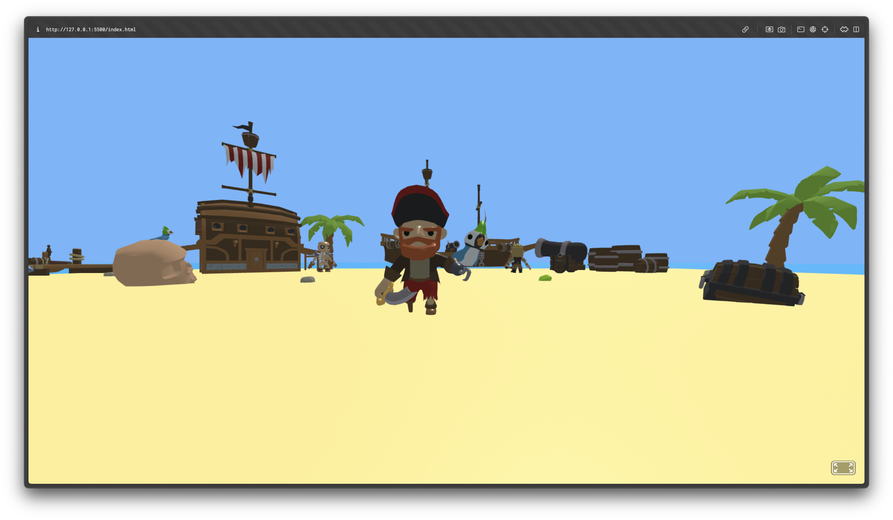

# 🏴‍☠️ Neverland: Pirate Island

> “Now... bring me that horizon.” — *Captain Jack Sparrow*

this is a 3D pirate island built with [A-Frame](https://aframe.io). it is quite static in its functionality (except for the onclick animations on all the idle-y animated models) made as a fun website for exploration!

---

---

## Live Demo

[https://pari55051.github.io/neverland-the-website](https://pari55051.github.io/neverland-the-website)

---

## Controls

| Action      | Keys/Interaction     | 
|-------------|----------------------| 
| Move        | `W` `A` `S` `D` / Arrow Keys     | 
| Look Around | Mouse (click & drag) | 
| Interact    | Click on characters, tentacles and shark   | 

---

## Credits

- Built with: [A-Frame](https://aframe.io)
- Models: sourced from [Pirate Kit | Poly Pizza](https://poly.pizza/bundle/Pirate-kit-0q5ulmIYqQ)
- shoutout to: [BabylonJS Sandbox](https://sandbox.babylonjs.com/) for helping me view and time all the animations nicely

- Created by: [unowen](https://github.com/pari5501)

---
